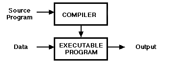
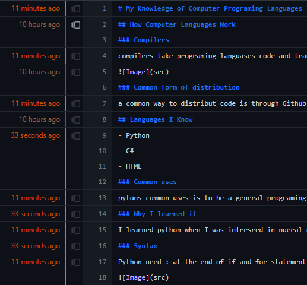

# My Knowledge of Computer Programing Languages
## How Computer Languages Work
### Compilers
compilers take programing languases code and translate to machine code which is why syntax is important

### Common form of distribution
a common way to distribut code is through Github
## Languages I Know
- Python
- C#
- HTML
### Common uses
pytons common uses is to be a general programing language for most uses. C# is commonly used in video game making sofware such as unity. HTML is used to make websites for quick acess on the Internet
### Why I learned it
I learned python when I was intresred in nueral networks and tried to make one. I learned C# when making a video game I came up with. I learned a small amount of HTML in class for making a website.
### Syntax
Python need : at the end of if and for statements, needs two = in an if statement, and is strict with indents. C# needs ; at the end of most non if statements and need {} around most indents. HTML needs <> around every definiton and closes with </> <h> is for headings and 
 is for paragraphs.

